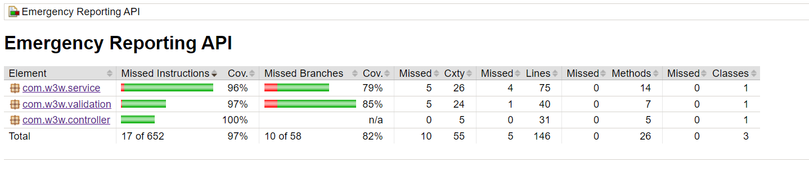

# w3w-emergeny-reporting-api
A RESTful API for emergency reporting which uses the w3w API for converting coordinates into three word addresses and converting three word addresses into coordinates.

## Please find the <b>Jacoco report</b> [here](https://github.com/mihirsoni826/w3w-emergeny-reporting-api/tree/main/emergency-reporting-service/target/site/jacoco).
Screenshot:



## Sample request/response payloads:

<b><mark>Context Path:</mark></b> /emergencyapi

* [/reports](#1-emergencyapireports)
  * [Valid request/response](#reports---valid-requestresponse-)
  * [Erroneous request/response](#erroneous-requestresponse-)
* [/welsh-convert](#2-emergencyapiwelsh-convert)
  * [Valid request/response](#welsh-convert---valid-requestresponse-)
  * [Erroneous request/response](#welsh-convert---erroneous-requestresponse-)
* [/welsh-3wa](#3-post-welsh-3wa)
  * [Valid request/response](#welsh-3wa---valid-requestresponse)
  * [Erroneous request/response](#welsh-3wa---erroneous-requestresponse)

### 1. POST /reports
Used to convert a valid set of coordinates to a valid three word address and vice-versa.
#### /reports - Valid Request/Response:
```
Request:
{
    "message": "Hiker stuck",
    "lat": null,
    "lng": null,
    "3wa": "filled.count.soap",
    "reportingOfficerName": "Mihir"
}
---------- OR ---------- 
{
    "message": "Hiker stuck",
    "lat": 51.520847,
    "lng": -0.195521,
    "3wa": null,
    "reportingOfficerName": "Mihir"
}

Response:

{
    "message": "Hiker stuck",
    "lat": 51.520847,
    "lng": -0.195521,
    "3wa": "filled.count.soap",
    "reportingOfficerName": "Mihir"
}
```

#### /reports - Erroneous request/response:
Non-null empty three word address
```
Request:
{
    "message": "Hiker stuck",
    "lat": null,
    "lng": null,
    "3wa": "",
    "reportingOfficerName": "Mihir"
}

Response:
{
    "message": "words or 'null' should be provided"
}
```
All values null
```
Request:
{
    "message": "Hiker stuck",
    "lat": null,
    "lng": null,
    "3wa": null,
    "reportingOfficerName": "Mihir"
}

Response:
{
    "message": "Address cannot be null"
}
```
Valid but incorrect/incomplete three word address
```
Request:
{
    "message": "Hiker stuck",
    "lat": null,
    "lng": null,
    "3wa": "filled.count.so",
    "reportingOfficerName": "Mihir"
}

Response:
{
    "message": "3wa not recognised: filled.count.so",
    "suggestions": [
        {
            "country": "GB",
            "nearestPlace": "Bishops Lydeard, Somerset",
            "words": "filled.count.song"
        },
        {
            "country": "GB",
            "nearestPlace": "Whitley Bay, Tyne & Wear",
            "words": "filled.count.shop"
        },
        {
            "country": "GB",
            "nearestPlace": "Bayswater, London",
            "words": "filled.count.soap"
        }
    ]
}
```
Invalid three word address
```
Request:
{
    "message": "Hiker stuck",
    "lat": null,
    "lng": null,
    "3wa": "filled.count",
    "reportingOfficerName": "Mihir"
}

Response:
{
    "message": "3wa address supplied has invalid format"
}
```
Coordinates/Three word address outside UK
```
Request:
{
    "message": "Hiker stuck",
    "lat": null,
    "lng": null,
    "3wa": "toddler.geologist.animated",
    "reportingOfficerName": "Mihir"
}
---------- OR ----------
{
    "message": "Hiker stuck",
    "lat": 28.646601,
    "lng": 77.227031,
    "3wa": null,
    "reportingOfficerName": "Mihir"
}

Response:
{
    "message": "Address is outside UK. Please provide a UK address"
}
```
Invalid coordinates
```
Request:
{
    "message": "Hiker stuck",
    "lat": 281.646601,
    "lng": 77.227031,
    "3wa": null,
    "reportingOfficerName": "Mihir"
}

Response:
{
    "message": "Coordinates are invalid. Please provide valid latitude and longitude - latitudes (-90 to 90) and longitudes (-180 to 180)"
}
```

### 2. POST /welsh-convert
Used to translate a valid English three word address to Welsh.

#### /welsh-convert - Valid request/response:
```
Request:
{
    "3wa": "filled.count.soap"
}

Response:
{
    "3wa": "ysgafn.dibyn.cefnogaeth"
}
```

#### /welsh-convert - Erroneous request/response:
Valid but incorrect/incomplete English three word address
```
Request:
{
    "3wa": "filled.soap.coun"
}

Response:
{
    "message": "3wa not recognised: filled.soap.coun",
    "suggestions": [
        {
            "country": "GB",
            "nearestPlace": "Torpoint, Cornwall",
            "words": "filled.soap.corn"
        },
        {
            "country": "GB",
            "nearestPlace": "Whitley Bay, Tyne & Wear",
            "words": "filled.soap.soup"
        },
        {
            "country": "GB",
            "nearestPlace": "Eton Wick, Berkshire",
            "words": "filled.soap.couch"
        }
    ]
}
```
Invalid English three word address
```
Request:
{
    "3wa": "filled.soap"
}

Response:
{
    "message": "3wa address supplied has invalid format"
}
```
English three word address outside UK:
```
Request:
{
    "3wa": "toddler.geologist.animated"
}

Response:
{
    "message": "Address is outside UK. Please provide a UK address"
}
```

### 3. POST /welsh-3wa
Used to translate a valid Welsh three word address to English.

#### /welsh-3wa - Valid request/response
```
Request:
{
    "3wa": "ysgafn.dibyn.cefnogaeth"
}

Response:
{
    "3wa": "filled.count.soap"
}
```

#### /welsh-3wa - Erroneous request/response
Valid but incorrect/incomplete Welsh three word address
```
Request:
{
    "3wa": "ysgafn.dibyn.cefno"
}

Response:
{
    "message": "3wa not recognised: ysgafn.dibyn.cefno",
    "suggestions": [
        {
            "country": "GB",
            "nearestPlace": "Llundain",
            "words": "ysgafn.diben.cefnu"
        },
        {
            "country": "GB",
            "nearestPlace": "Barnt Green, Swydd Gaerwrangon",
            "words": "ysgafn.dibyn.cofnod"
        },
        {
            "country": "GB",
            "nearestPlace": "Plumpton Green, Dwyrain Sussex",
            "words": "ysgafn.dibyn.cefnoga"
        }
    ]
}
```
Invalid Welsh three word address
```
Request:
{
    "3wa": "ysgafn.dibyn"
}

Response:
{
    "message": "3wa address supplied has invalid format"
}
```
Welsh three word address outside UK
```
Request:
{
    "3wa": "mafon.mwnci.cyfran"
}

Response:
{
    "message": "Address is outside UK. Please provide a UK address"
}
```